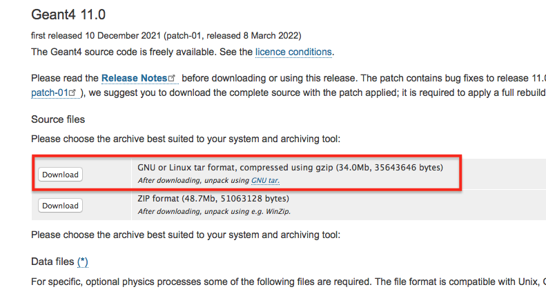

Preliminaries
--------------

In this section we briefly review the essential elements of the technical environment
that will be used throughout the course. This includes the working environment,
basic tools, and a few key C++ concepts required to understand how :guilabel:`Geant4`
applications are built.

Working environment
....................

Virtual Machine
^^^^^^^^^^^^^^^

During this course, all exercises will be performed inside a pre-configured
**Virtual Machine (VM)**, provided by the `Laboratoire de Physique des Deux Infinis Bordeaux (LP2i Bordeaux), CNRS/IN2P3/Bordeaux University <https://extra.lp2ib.in2p3.fr/G4/>`_. Please see the corresponding `README <https://heberge.lp2ib.in2p3.fr/G4VM/Vmware/Stable/geant4.11.4.1/readme-g4.11.4.1>`_ for more information.

Using this VM ensures that all participants work in the same
environment, avoiding installation and compatibility issues.

The VM contains:
- a working installation of :guilabel:`Geant4`
- all required dependencies
- development tools

There is a default :envvar:`local1` user account created on your linux VM with the :envvar:`local1` password (the root password is :envvar:`rocky8.5`). The :envvar:`/home/local1` home directory location is set in the :envvar:`HOME` environmental variable.

.. admonition:: **Take-home**
   :class: takehome

   You should consider the VM as your standard working environment for this tutorial.

There are several :guilabel:`Geant4` specific environmental variables set in the system. You can see them by::

  localhost.localdomain:/local1 printenv | grep G4
  G4INSTALL=/usr/local/geant4.11.4.1
  G4BUILD=/usr/local/src/build
  G4ALPHAHPDATA=/usr/local/geant4.11.4.1/share/Geant4-11.4.1/data/G4TENDL1.4/Alpha
  G4UI_USE_TCSH=1
  G4SAIDXSDATA=/usr/local/geant4.11.4.1/share/Geant4-11.4.1/data/G4SAIDDATA2.0
  G4INCL=/usr/local/geant4.11.4.1/share/Geant4-11.4.1/data/G4INCL1.0
  G4REALSURFACEDATA=/usr/local/geant4.11.4.1/share/Geant4-11.4.1/data/RealSurface2.2
  G4VIS_USE=1
  G4LEVELGAMMADATA=/usr/local/geant4.11.4.1/share/Geant4-11.4.1/data/PhotonEvaporation5.7
  G4UI_USE_QT=1
  G4LIB_USE_GDML=1
  G4EXAMPLES=/usr/local/geant4.11.4.1/share/Geant4-11.4.1/examples
  G4LIB=/usr/local/geant4.11.4.1/lib64
  G4NEUTRONXSDATA=/usr/local/geant4.11.4.1/share/Geant4-11.4.1/data/G4PARTICLEXS4.0
  G4COMP=/usr/local/geant4.11.4.1/lib64/Geant4-11.4.1
  G4SRC=/usr/local/src/geant4-v11.4.1
  G4VIS_BUILD_OPENGLX_DRIVER=1
  G4ANALYSIS_USE=1
  G4LIB_BUILD_GDML=1
  G4TRITONHPDATA=/usr/local/geant4.11.4.1/share/Geant4-11.4.1/data/G4TENDL1.4/Triton
  G4VIS_USE_OPENGLX=1
  G4RADIOACTIVEDATA=/usr/local/geant4.11.4.1/share/Geant4-11.4.1/data/RadioactiveDecay5.6
  G4NEUTRONHPDATA=/usr/local/geant4.11.4.1/share/Geant4-11.4.1/data/G4NDL4.6
  G4ABALDATA=/usr/local/geant4.11.4.1/share/Geant4-11.4.1/data/G4ABLA3.1
  G4ENSDFSTATEDATA=/usr/local/geant4.11.4.1/share/Geant4-11.4.1/data/G4ENSDFSTATE2.3
  G4INCLUDE=/usr/local/geant4.11.4.1/include/Geant4
  G4PIIDATA=/usr/local/geant4.11.4.1/share/Geant4-11.4.1/data/G4PII1.3
  G4SYSTEM=Linux-g++
  G4DEUTERONHPDATA=/usr/local/geant4.11.4.1/share/Geant4-11.4.1/data/G4TENDL1.4/Deuteron
  G4PARTICLEXSDATA=/usr/local/geant4.11.4.1/share/Geant4-11.4.1/data/G4PARTICLEXS4.0
  G4WORKDIR=/home/local1/geant4/work
  G4HE3HPDATA=/usr/local/geant4.11.4.1/share/Geant4-11.4.1/data/G4TENDL1.4/He3
  G4PROTONHPDATA=/usr/local/geant4.11.4.1/share/Geant4-11.4.1/data/G4TENDL1.4/Proton
  G4LEDATA=/usr/local/geant4.11.4.1/share/Geant4-11.4.1/data/G4EMLOW8.0

in a terminal window. You can open a :envvar:`Terminal` window in your system by clicking :envvar:`Activities -> Terminal`. Some of these, e.g. the :guilabel:`Geant4` data set location related variables like the :envvar:`G4LEDATA` that points to the low energy EM physics data set location, are **required** to be set for the operation of :guilabel:`Geant4`.
These required environmental variables are usually set in the post-install procedure (see at the end of the :ref:`Configure, build and install, <ref_InstallFromSource>` part above).
Other :guilabel:`Geant4`, **optional** environmental variables are set in your VM system simply for convenience. These can be grouped to :guilabel:`Geant4` (build) configuration and some location related environmental variables.
The first set was used during the production of the VM build of the toolkit to turn ``ON/OFF`` some of the :guilabel:`Geant4` optional :ttt:`CMake` configuration option e.g.

 - :envvar:`G4VIS_USE_OPENGLX`: that was used to turn ``ON/OFF`` the :envvar:`GEANT4_USE_OPENGL_X11` :guilabel:`Geant4` optional :ttt:`CMake` configuration option for enabling the visualization component with :ttt:`OpenGL-Xlib` driver (i.e. :ttt:`OpenGL` with the :ttt:`X11 X Window System`).
 - :envvar:`G4UI_USE_QT`: that was used to turn ``ON/OFF`` the :envvar:`GEANT4_USE_QT` :guilabel:`Geant4` optional :ttt:`CMake` configuration option for enabling the :ttt:`Qt` based Graphical User Interface (GUI)

The second set contains those variables that makes easy the locate the directories of the :guilabel:`Geant4` source code (:envvar:`G4SRC`), install (:envvar:`G4INSTALL`) or the configuration location (:envvar:`G4COMP`) that needs to be provided in the required ``Geant4_DIR`` :ttt:`CMake` input variable when compiling any :guilabel:`Geant4` applications.
You can print any of these variable values just before by::

  localhost.localdomain:/local1 < 67 >echo $G4SRC
  /usr/local/src/geant4-v11.4.1

Unix commands
^^^^^^^^^^^^^

We will interact with the system mainly through a Unix terminal. Only a minimal set
of commands is required:

==========================   ====================
     Command                    Meaning / effect
==========================   ====================
    ``ls``                        list files in the current directly
    ``ls -l``                     same as above in long format (more details)
    ``cp`` `file1` `file2`        copy `file1` to `file2`
    ``mv`` `file1` `file2`        move/rename `file1` to `file2`
    ``rm`` `file`                 remove/delete `file`
    ``pwd``                       print working directory (Where am I?)
    ``.``                         the current working directory
    ``..``                        parent directory
    ``cd`` `dirname`              change to `dirname` directory
    ``mkdir`` `dirname`           make directory with the name `dirname`
    ``cat`` `file`                show the content of `file`
    ``more`` `file`               shows the file page by page
    ``ctrl + C``                  interrupts the running process
    ``echo`` `string`             write out the string (e.g. write out the value of a shell variable like PATH as ``echo $PATH``)
    ``$``                         use the ``$`` prefix front of shell variables to get their value (e.g. above)
==========================   ====================

.. _ref_InstallFromSource:

:guilabel:`Geant4` installation
...................

A working installation of :guilabel:`Geant4` is already available in the Virtual Machine, and therefore this section can be skipped. However, it may be useful to have an overview how to make an installation from the source code and learn the tools to inspect a given installation.

.. tip::

    Please refer to the `official documentation <https://geant4-userdoc.web.cern.ch/UsersGuides/InstallationGuide/html/index.html>`_ for further details

Pre-requisites
^^^^^^^^^^^^^^

The minimal requisites are a C++ compiler and cmake. Some features rely on external packages, for instance visualization or `GDML` support. The default installation requires around 3 GB of space, but more space is needed if some features are enabled.

Download the source code
^^^^^^^^^^^^^^^^^^^^^^^^

We can download the source code, either from the official webpage, :g4wpage:`support/download, Downloads` (see the screenshot in :numref:`fig_g4download_screenshot`) or `GitHub <https://github.com/Geant4/geant4/archive/refs/tags/v11.4.1.tar.gz>`_

.. _fig_g4download_screenshot:

   :guilabel:`Geant4` page screen shot for downloading the toolkit source code

Configure and build with :ttt:`CMake`
^^^^^^^^^^^^^^^^^^^^^^^^^^^^^^^^^^^^^

To decompress the code, in a terminal, change to the directory where the downloaded file is by using ``cd`` command. Then, we can see the following when we list the content with the ``ls`` command::

  bash-3.2$ ls
  geant4-v11.4.1.tar.gz

Then we can uncompress the source code by::

  bash-3.2$ tar -xzvf geant4-v11.4.1.tar.gz

that eventually will create a subdirectory containing all the source code::

  bash-3.2$ ls
  geant4-v11.4.1		geant4-v11.4.1.tar.gz

It will be assumed in the following that the created subdirectory, with all the uncompressed :guilabel:`Geant4` source code, is :file:`G4SRC`. This means :file:`G4SRC` = :file:`full/path/to/geant4-v11.4.1` in the above example (please note, that you need to replace ``/full/path/to`` with your actual path to the uncompressed source directory), that can be set as an environment variable as::

  bash-3.2$ export G4SRC=/full/path/to/geant4-v11.4.1

Then we can check if everything set properly by writing the value of the newly created environment variable as::

  bash-3.2$ echo $G4SRC
  /full/path/to/geant4-v11.4.1

We can also create environmental variables that will point to the build and install directories, as follows::

  bash-3.2$ export G4BUILD=/full/path/to/geant4-v11.4.1-build
  bash-3.2$ export G4INSTALL=/full/path/to/geant4-v11.4.1-install

To **configure** the build, we use ``cmake`` as follows::

  bash-3.2$ cmake -S $G4SRC -B $G4BUILD -D CMAKE_INSTALL_PREFIX=$G4INSTALL

where the ``cmake`` option ``-S`` is used to point to the source code directory, ``-B`` to point to the build directory (used for temporal storage) and we use the variable ``CMAKE_INSTALL_PREFIX`` to point to the install directory (where the useful byproducts of the compilation will be copied).

.. tip::

    You can inspect the configuration and change it by using a cmake tool (like ``ccmake`` or ``cmake-gui``), or directly inspecting the
    ``CMakeCache.txt`` in the build directory ``G4BUILD``. The variable value can be modified by adding ``-D VAR=NEW_VALUE``. For example, to enable installation of example applications::
              bash-3.2$ cmake -S $G4SRC \
                              -B $G4BUILD \
                              -D CMAKE_INSTALL_PREFIX=$G4INSTALL \
                              -D GEANT4_INSTALL_EXAMPLES=ON

To **compile** the source code, we use the following command::

  bash-3.2$ cmake --build $G4BUILD -- -j4 install

The option ``-j4`` flags that compilation can be done in parallel using 4 threads, and ``install`` keyword indicates to copy the final files to ``G4INSTALL`` directory. During the compilation,the data libraries needed by :guilabel:`Geant4` are also downloaded (unless the feature is disabled)

.. _ref_G4-post-installation:

Post-installation
^^^^^^^^^^^^^^^^^

If we take a look to the installation directory, we should see the following::

    bash-3.2$ ls $G4INSTALL
    bin  include  lib64  share

and in the ``bin`` directory in particular,::

    bash-3.2$ ls $G4INSTALL/bin
    geant4-config  geant4.csh  geant4.sh

The bash script ``geant4.sh`` can be used to setup a number of environmental variables that will be useful when building our application later::

    bash-3.2$ source $G4INSTALL/bin/geant4.sh

The script ``geant4-config`` can be used to retrieve information about the version, configuration options, datasets, etc::

    bash-3.2$ geant4-config --help
    Usage: geant4-config [OPTION...]
      --prefix                output installation prefix of Geant4
      --version               output version for Geant4
      --cxxstd                C++ Standard compiled against
      --tls-model             Thread Local Storage model used
      --libs                  output all linker flags
      --cflags                output all preprocessor
                              and compiler flags

      --libs-without-gui      output linker flags without
                              GUI components
      --cflags-without-gui    output preprocessor and compiler
                              flags without GUI components

      --has-feature FEATURE   output yes if FEATURE is supported,
                              or no if not supported

      --features              print list of features

      --sh                    print shell commands required to set environment
                              variables for Geant4, which can be evaluated in
                              the calling shell with "eval $(geant4-config --sh)"

      --csh                   print C shell commands required to set environment
                              variables for Geant4, which can be evaluated in
                              the calling shell with "eval `geant4-config --csh`"

      --datasets              output dataset name, environment variable
                              and path, with one line per dataset

      --check-datasets        output dataset name, installation status and
                              expected installation location, with one line
                              per dataset

      --install-datasets      download and install any missing datasets,
                              requires a network connection and for the dataset
                              path to be user writable

Try an example application
^^^^^^^^^^^^^^^^^^^^^^^^^^

:guilabel:`Geant4` provides a collection of examples under the directory ``G4INSTALL/share/Geant4/examples``::

    bash-3.2$ ls $G4INSTALL/share/Geant4/examples
    advanced  basic  CMakeLists.txt  extended  GNUmakefile  History  README.HowToRun.md  README.HowToRunMT.md  README.md

    bash-3.2$ ls $G4INSTALL/share/Geant4/examples/basic
    B1  B2  B3  B4  B5  CMakeLists.txt  GNUmakefile  History  README.md

We can compile one of them in our working directory, by using the following commands::

    bash-3.2$ cmake -S $G4INSTALL/share/Geant4/examples/basic/B1 \
                    -B build_example_basic_B1 \
                    -D CMAKE_INSTALL_PREFIX=install_example_basic_B1 \
                    -D Geant4_DIR=$G4INSTALL/lib64/
    bash-3.2$ cmake --build build_example_basic_B1 -- -j 8

and we can run it as::

    bash-3.2$ ./build_example_basic_B1/exampleB1 ./build_example_basic_B1/run1.mac

If everything goes well, the program starts by printing out the :guilabel:`Geant4` banner, runs 1 event and finish normally.

First steps with C++
....................

In this section we will go through 3 key points needed for the rest of the course

- What is a C++ application
- How to build and compile a C++ application
- The concept of *interface*

First C++ application
^^^^^^^^^^^^^^^^^^^^^

Before introducing :guilabel:`Geant4`, we start with a minimal C++ program.

Consider the following simple `"Hello World!"` C++ code. In oour VM, we create a directory calle :file:`$HOME/geant4/work/preli_cmake` using ``mkdir`` command, then we move to that directory using ``cd`` command, and then we create a text file :file:`ourmain.cc` with the following content shown by ``cat`` command::

  bash-3.2$ mkdir -p $HOME/geant4/work/preli_cmake
  bash-3.2$ cd $HOME/geant4/work/preli_cmake/
  bash-3.2$ cat ourmain.cc

.. code-block:: cpp

  #include <iostream>

  int main() {

    std::cout << " Hello World! " << std::endl;

    return 0;
  }

We can compile the source code using the GCC compiler (``g++`` command) and then run it::

  bash-3.2$ g++ -o ourmain ourmain.cc
  bash-3.2$ ./ourmain
   Hello World!

Now we can try to use a component from :guilabel:`Geant4` in this application.
We can declare a variable but using a :guilabel:`Geant4` defined
type ``G4double`` from :file:`$G4SRC/source/global/management/include/G4Types.hh`, instead of the standard C++ one ``double``

.. code-block:: cpp

  #include <iostream>

  // include the Geant4 header where the G4double variable defined
  #include "G4Types.hh"

  int main() {

    // a Geant4 defined variable type
    // from $G4SRC/source/global/management/include/G4Types.hh
    G4double x = 1.23;

    std::cout << " Hello World! " << std::endl;

    return 0;
  }

when we try to compile now as before, we get an error::

  bash-3.2$ g++ -o ourmain ourmain.cc
  ourmain.cc:4:10: fatal error: G4Types.hh: No such file or directory
   #include "G4Types.hh"
            ^~~~~~~~~~~~
  compilation terminated.

The error tell us that the compiler cannot find :file:`G4Types.hh` file. The compiler knows where the standard header files are, for instance ``iostream``, but not where custom files. We can tell the compiler to look for header files in extra directories with the option ``-I /path/to/headers``. In case of :guilabel:`Geant4`, inside the installation directory there is a directory called ``include/Geant4`` which contains all the public headers. We can include the path to the headers like this::

  bash-3.2$ g++ -I $G4INSTALL/include/Geant4 -o ourmain ourmain.cc
  bash-3.2$ ./ourmain
   Hello World!

Cool. But what if I want to use now something that needs more than the declaration (more than the header) i.e. the library as well? A simply example
is ``G4cout, G4endl`` from the :file:`$G4SRC/source/global/management/include/globals.hh` (actually deeper but never mind, this include works fine)
that is the :guilabel:`Geant4` version of ``std::cout, std::endl``

.. code-block:: cpp

  #include <iostream>

  // include the Geant4 header for G4cout and G4endl (also includes G4Types.hh)
  #include "globals.hh"

  int main() {

    // a Geant4 defined variable type (form $G4SRC/source/global/management/include/G4Types.hh)
    G4double x = 1.23;

    // write out the variable value using G4cout
    G4cout << " x = " << x << G4endl;

    std::cout << " Hello World! " << std::endl;

    return 0;
  }

However, when compiling this like before we get an error::

    bash-3.2$ g++ -I $G4INSTALL/include/Geant4 -o ourmain ourmain.cc
    In file included from /usr/local/geant4.11.0.1/include/Geant4/globals.hh:50,
                     from ourmain.cc:4:
    /usr/local/geant4.11.0.1/include/Geant4/G4String.hh:117:31: error: ‘std::string_view’ has not been declared
       inline G4int compareTo(std::string_view, caseCompare mode = exact) const;

We need to make sure now that the application is linked with the required libraries

However, when compiling this like before we get an error::

    bash-3.2$ g++ -I $G4INSTALL/include/Geant4 -o ourmain ourmain.cc
    In file included from /usr/local/geant4.11.0.1/include/Geant4/globals.hh:50,
                     from ourmain.cc:4:
    /usr/local/geant4.11.0.1/include/Geant4/G4String.hh:117:31: error: ‘std::string_view’ has not been declared
       inline G4int compareTo(std::string_view, caseCompare mode = exact) const;

We need to make sure now that the application is linked with the required libraries, located :envvar:`libG4global` and :envvar:`libG4ptl`
that are under the :file:`G4INSTALL/lib64` directory. The library location can be specified as ``-L$G4INSTALL/lib64`` then linked as ``-lG4global -lG4ptl``. We also need to specify the C++ standard, since :guilabel:`Geant4` requires now C++ standard 17, that can be done by ``-std=c++17``. We need to set the run-time linker path as well with ``-Wl,-rpath,$G4INSTALL/lib64``, so the path to the shared libraries is stored in the final executable. We can put all together::

  bash-3.2$ g++ -o ourmain ourmain.cc \
                -std=c++17 \
                -I $G4INSTALL/include/Geant4 \
                -L $G4INSTALL/lib64 \
                -lG4global -lG4ptl \
                -Wl,-rpath,$G4INSTALL/lib64

  bash-3.2$ ./ourmain
   x = 1.23
   Hello World!

.. admonition:: **Take-home**
   :class: takehome

   At this point, you have successfully compiled and run your first C++ program that uses :guilabel:`Geant4` components

In general, to compile an application we may need even more flags or libraries. We can list the compilation flags used by Geant4 using the ``geant4-config`` script::

  bash-3.2$ echo `G4INSTALL/bin/geant4-config --cflags`
  -DG4VIS_USE_OPENGL -DG4UI_USE_TCSH -DG4UI_USE_QT -DG4VIS_USE_OPENGLQT -DG4VIS_USE_TOOLSSG_QT_GLES -I/usr/local/qt5.15.2/include/ -I/usr/local/qt5.15.2/include/QtCore -I/usr/local/qt5.15.2/.//mkspecs/linux-g++ -I/usr/local/qt5.15.2/include/QtGui -I/usr/local/qt5.15.2/include/QtWidgets -I/usr/local/qt5.15.2/include/QtOpenGL -DG4UI_USE_QT3D -W -Wall -pedantic -Wno-non-virtual-dtor -Wno-long-long -Wwrite-strings -Wpointer-arith -Woverloaded-virtual -Wno-variadic-macros -Wshadow -pipe -pthread -ftls-model=initial-exec -std=c++17 -I/usr/local/geant4_11.2p2/include/Geant4

Similarly, to list the :guilabel:`Geant4` libraries::

  bash-3.2$ echo `G4INSTALL/bin/geant4-config --libs`
  -L/usr/local/geant4_11.2p2/lib64 -lG4OpenGL -lG4visQt3D -lG4Tree -lG4FR -lG4GMocren -lG4visHepRep -lG4RayTracer -lG4VRML -lG4ToolsSG -lG4vis_management -lG4modeling -lG4gdml -lG4interfaces -lG4geomtext -lG4mctruth -lG4analysis -lG4error_propagation -lG4readout -lG4physicslists -lG4run -lG4event -lG4tracking -lG4parmodels -lG4processes -lG4digits_hits -lG4track -lG4particles -lG4geometry -lG4materials -lG4graphics_reps -lG4intercoms -lG4global -lG4clhep -lG4ptl

Using this utility, we could simplify the compilation as::

  bash-3.2$ g++ -o ourmain ourmain.cc `geant4-config --cflags --libs`

However, this approach is superseeded by CMake.

CMake as configuration tool
^^^^^^^^^^^^^^^^^^^^^^^^^^^

When building applications that depend on external libraries such as
:guilabel:`Geant4`, manual compilation quickly becomes impractical.

:ttt:`CMake` is a build configuration tool that simplifies this process by:

- locating required libraries

- configuring compiler settings

- generating build files automatically

In this course, we will use :ttt:`CMake` to build our applications in a simple
and reproducible way. The configuration file is always called ``CMakeLists.txt``.
In the same directory as ``ourmain.cc``, we can create that file with the following content::

  cmake_minimum_required(VERSION 3.16)
  find_package(Geant4 REQUIRED)
  include(${Geant4_USE_FILE})

  add_executable(ourmain ourmain.cc)
  target_link_libraries(ourmain ${Geant4_LIBRARIES})

The function ``find_package`` will load all the environmental variables and flags needed to build an application compliant with the  :guilabel:`Geant4` installation. The function ``add_executable`` will build and link our executable against the needed libraries. With the function ``target_link_libraries`` we are configuring the build of the final executable ``ourmain`` to link against :guilabel:`Geant4` libraries.

.. tip::

   Take a look to :file:`$G4INSTALL/share/Geant4/examples/basic/B1/CMakeLists.txt`, the CMake configuration file
   for one of the Geant4 example application, and spot the similarities and differences with respect to our file

First, we need to **configure** the build, using ``cmake`` as follows::

  bash-3.2$ cmake -S . -B build

where the ``cmake`` option ``-S`` is used to point to the source code directory, ``-B`` to point to the build directory (used for temporal storage).:ttt:`CMake` requires the location of the :guilabel:`Geant4` toolkit :ttt:`CMake` configuration file, that
has been installed under the :file:`$G4INSTALL/lib64/`. We can use the syntax ``-D VAR=NEW_VALUE`` to tell CMake where to find the installation directory in case we did not gone throught the post-installation step (:ref:`ref_G4-post-installation`)::

  bash-3.2$ cmake -S . -B build -D Geant4_DIR=$G4INSTALL/lib64/

To **compile** the source code, we use the following command::

  bash-3.2$ cmake --build build

CMake creates many files in the ``build`` directory, including our executable, that we can run as the following::

  bash-3.2$ ./build/ourmain
   x = 1.23
   Hello World!

We can add a printout in the ``CMakeLists.txt`` ::

  message("---> We print out the value of Geant4_LIBRARIES: ${Geant4_LIBRARIES}")

If run again the **configure** step, it will printout the libraries that CMake find and use to link our application::

  ---> We print out the value of Geant4_LIBRARIES: Geant4::G4Tree;Geant4::G4FR;Geant4::G4GMocren;Geant4::G4visHepRep;Geant4::G4RayTracer;Geant4::G4VRML;Geant4::G4ToolsSG;Geant4::G4vis_management;Geant4::G4modeling;Geant4::G4interfaces;Geant4::G4mctruth;Geant4::G4geomtext;Geant4::G4gdml;Geant4::G4analysis;Geant4::G4error_propagation;Geant4::G4readout;Geant4::G4physicslists;Geant4::G4run;Geant4::G4event;Geant4::G4tracking;Geant4::G4parmodels;Geant4::G4processes;Geant4::G4digits_hits;Geant4::G4track;Geant4::G4particles;Geant4::G4geometry;Geant4::G4materials;Geant4::G4graphics_reps;Geant4::G4intercoms;Geant4::G4global;Geant4::G4tools;Geant4::G4clhep;Geant4::G4ptl

.. admonition:: **Take-home**
   :class: takehome

   CMake allows you to build complex applications without manually managing dependencies.

   Without CMake, compiling a :guilabel:`Geant4` application would require manually specifying include paths and libraries.

Concept of interface
^^^^^^^^^^^^^^^^^^^^

:guilabel:`Geant4` solves particle transport simulation problems by relying on **interfaces**. This allows the toolkit to remain independent of specific implementation details.

An *interface* defines a set of behaviours without specifying how they are implemented. It describes *what* a class can do, but not *how* it does it.

Different classes can implement the same interface, each providing their own
specific behaviour, while guaranteeing that a common set of functionalities exists.

In :guilabel:`Geant4`, the simulation problem is defined by implementing a set of
such interfaces (e.g. detector description, physics configuration, primary generator).

Understanding this concept is essential, as it underlies the structure of any
:guilabel:`Geant4` application.

The following code shows two ``C++`` classes that represent a Cube and a Sphere
and have a method to calculate their volume

.. code-block:: cpp

    #include <iostream>

    class Cube {
    public:
        Cube(double l): fSide(l) {}
        double GetVolume() { return fSide * fSide * fSide; }
    private:
        double fSide;
    };

    class Sphere {
    public:
        Sphere(double r): fRadius(r) {}
        double GetVolume() { return (4.0/3.0) * 3.14159 * fRadius * fRadius * fRadius; }
    private:
        double fRadius;
    };

We may want to access the methods of these classes, for example to print their volume.
To do so, we have to implement two different functions, one for each class, with almost the same code:

.. code-block:: cpp

    void PrintVolume(Cube& c) {
        std::cout << "Volume is " << c.GetVolume() << std::endl;
    }

    void PrintVolume(Sphere& s) {
        std::cout << "Volume is " << s.GetVolume() << std::endl;
    }

This duplication becomes problematic as the number of shapes increases. Ideally, we would like to write the function only once, independently of the specific shape.

To avoid this duplication, we can introduce an interface that defines the common behaviour.
This interface only declares methods that derived classes must implement.

.. code-block:: cpp

    class Shape {
    public:
        virtual double GetVolume() = 0;
    };

And each particular shape that derives from class ``Shape`` will have to implement the same interface as follows:

.. code-block:: cpp

    class Cube : public Shape {
    public:
        Cube(double l): fSide(l) {}
        double GetVolume() override { return fSide * fSide * fSide; }
    private:
        double fSide;
    };

    class Sphere : public Shape {
    public:
        Sphere(double r): fRadius(r) {}
        double GetVolume() override {
            return (4.0/3.0) * 3.14159 * fRadius * fRadius * fRadius;
        }
    private:
        double fRadius;
    };

And now the function PrintVolume does not depend on the specific shape anymore.
It only requires that the object implements the ``Shape`` interface.

.. code-block:: cpp

  #include <iostream>

  void PrintVolume(Shape& s) {
      std::cout << "Volume is " << s.GetVolume() << std::endl;
  }

In :guilabel:`Geant4`, the same principle is used: the toolkit defines interfaces,
and the user provides concrete implementations to describe a specific simulation problem.

.. admonition:: **Take-home**
   :class: takehome

   An interface defines *what* an object can do, not *how* it does it.

   This allows us to write flexible code that works with many different implementations.

   In :guilabel:`Geant4`, you do not control the simulation engine directly:
   you describe the problem (geometry, field, physics, control actions), and the toolkit
   takes care of the execution.

